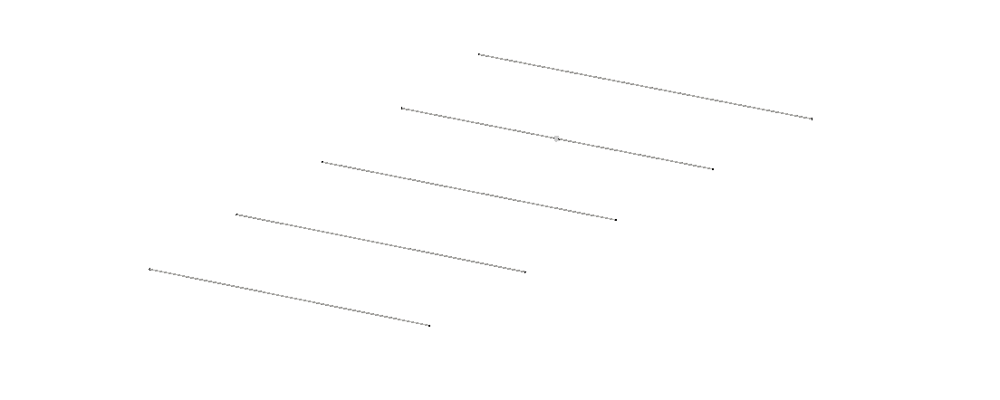
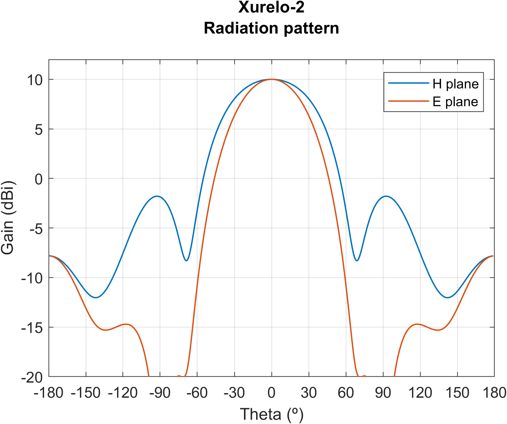
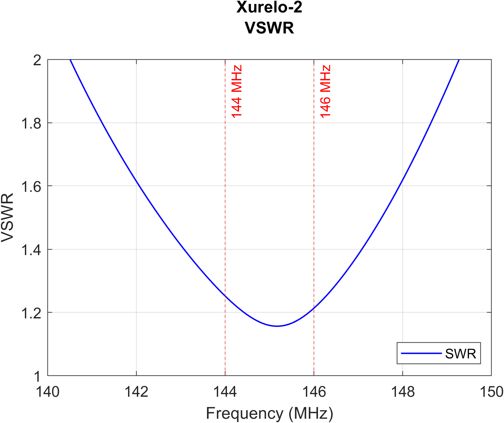
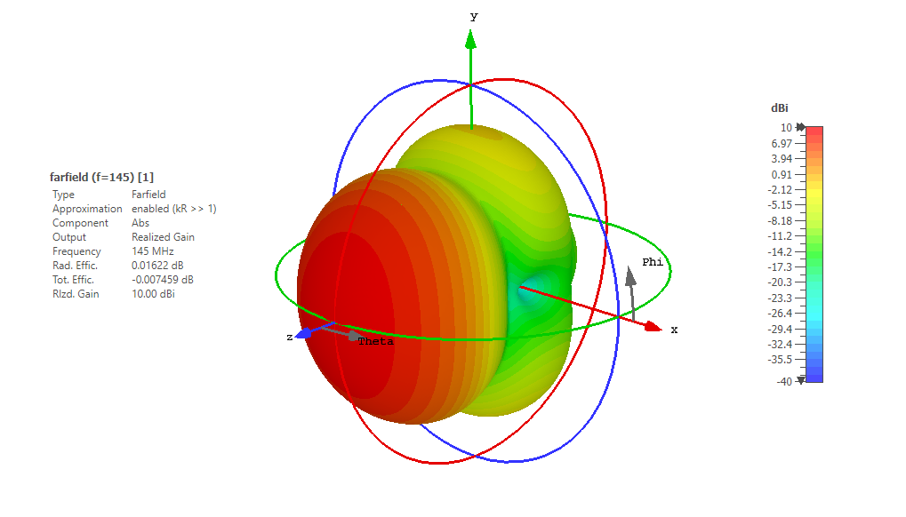
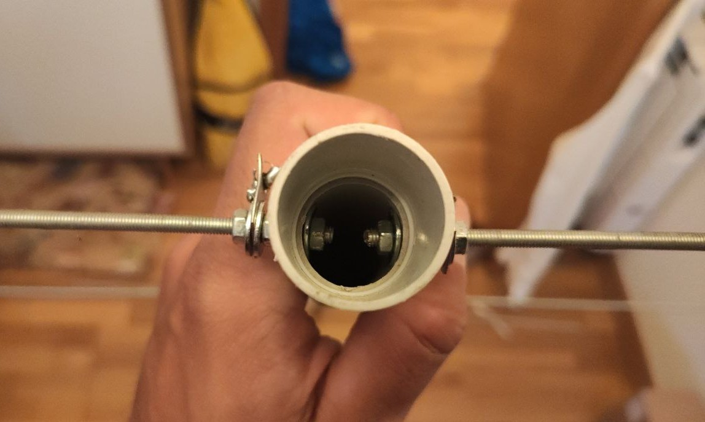
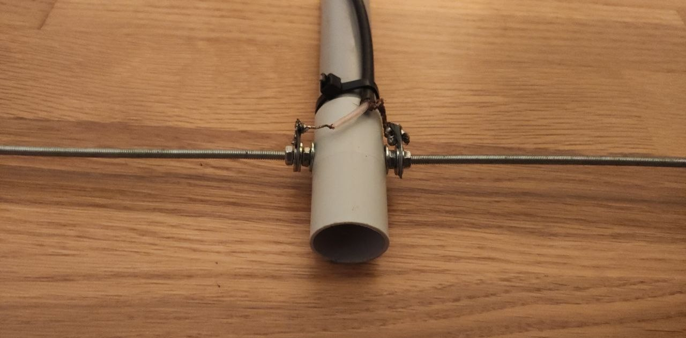
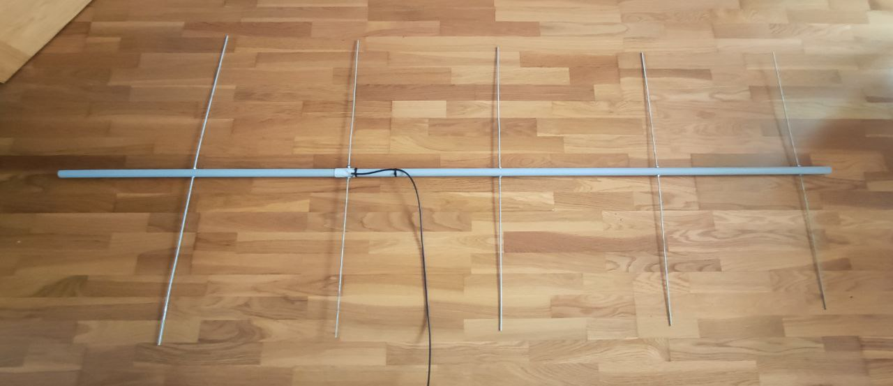
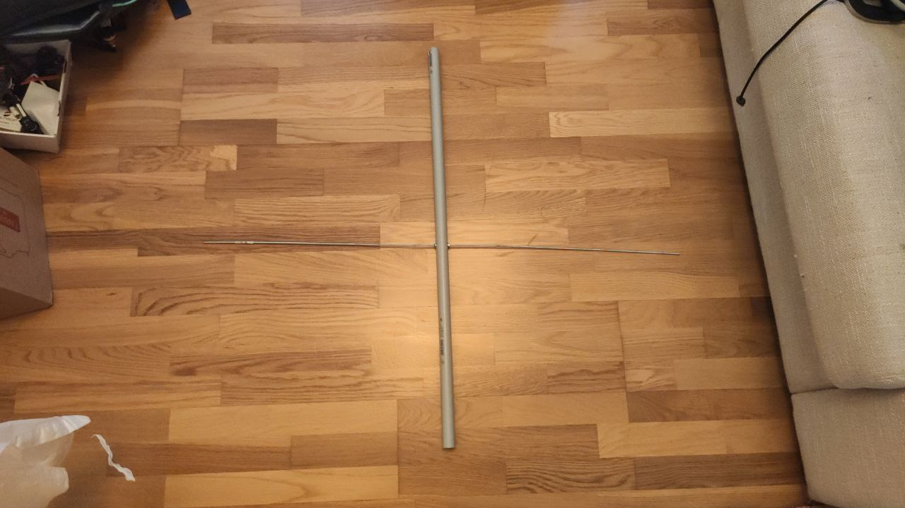

Want a high-gain and easy to build antenna for the 2m band? You came to the right place!

Xurelo-2 started as an afternoon project: during a week of extremely good conditions por tropo propagation, I found myself not having a Yagi antenna of more than 3 elements. As a result, I decided to design something that was fast to build, used easy to find materials and offered good specifications for working the 144MHz amateur band.

### Main features

The following list summarises some of the main characteristics of Xurelo-2

- **Cheap and easy to DIY:** following the do-it-yourself philosophy, Xurelo-2 has been design with the aim of using easy to find materials, ensuring all the necessary parts can be bought in any hardware store

- **Lightweight:** while it is possible to build this antenna from different materials, the use of M3 threaded rods guarantees its light weight , making it perfect for portable or ocasional use

- **Optimised spects for Amatur Radio:** Xurelo-4 is able to ofer good gain, Side Lobes Level and SWR across the whole 4m band

- **Balance between gain and length:** we most of the times want antennae to offer the highest gain, but this comes with the expense of longer booms. One of the contraints of this design was using a boom that could fit inside a normal car

- **Detachable reflector:** our design makes use of a detachable boom, which devides the antenna in two pieces (reflector and rest of the elements). This way, it saves a lot of space, fitting the antenna in smaller places

### Antenna Specifications

#### 144MHz / 2m

|           **Specification**           |  **Value** | **Units** |
|:-------------------------------------:|:----------:|:---------:|
|           Gain           |    7.32    |  dBi  |
| 3 dB Beamwidth (E plane) |    66.8    |   º   |
| 3 dB Beamwidth (H plane) |    114     |   º   |
|        Efficiency        |    99.8    |   %   |
|         Impedance        |    50      |   Ω   |
|        Lowest SWR        |    1.01    |   -   |
|         Bandwidth        |    4.2     |  MHz  |
|                          |    6.00    |   %   |
|       SLL (E plane)      |    -12.2   |   dB  |
|       SLL (H plane)      |    -12.2   |   dB  |
|       Polarization       |    Linear  |   -   |
|            XPD           |    >70     |   dB  |

*Note: bandwidth is measured between points at 1.5 SWR. XPD is referred to broadside direction*

Simulated radiation pattern | Measured SWR
:-------------------------:|:-------------------------:
  |  

### Bill of materials

|                 **Material**                  |**Quantity**|
|:---------------------------------------------:|:--------:|
|            M3* 1000mm threaded rods           |     6    |
|                   M3* nuts                    |    14    |
|                 M3* washers                   |    14    |
|            2500mm 20mm PVC boom**             |     1    |
|            20mm PVC tubing joint**            |     1    |
|             50Ohm coaxial cable               |    ~3m   |
|              SMA male connector               |     1    |

\* *M4 threaded rods can be used instead. In this case, we decided to use M3 parts in order to reduce the overall weight of the antenna. M4 will offer greater mechanical consistency.* 

\*\* *As the original Xurelo-2 prototype was conceived as an afternoon project, it uses a 20mm PVC mast. This should be replaced with propper materials such as fiberglass in order to use this antenna for extended periods of time or under extreme temperature conditions.*

### Assembly instructions

This instructions show the way we assembled the very first prototype of Xurelo-2. Note that a lot of steps can be improved, such as using some of the 3D-printable element supports from our repository instead of directly drilling the mast or designing a more durable transition between the coaxial cable and the dipole! The reader shall feel free to improve mechanical aspects of the design, always without modifying the electromagnetical properties of the antenna (use a non-conductive boom and respect the respective lengths and separations between elements).

>All of the measurements, plans, .stl files and more can be found in our [GitHub repository](https://github.com/pepassaco/FIDtennas)

1. Cut the threaded rods in the lengths described at our repository.

*Note: if you own a nanoVNA, you may be interested in cutting the dipoles a bit longer so that you can then tune the antenna according to you needs.*

2. Drill the boom at the places corresponding to the separation of the elements. Note that, for our design, we decided to use two different pieces of PVC tubing for the boom: one for the directors and active element and one for the reflector. This way, we can easily attach both legs of the dipole to the mast and we can disassemble the reflector to reduce the length of the antenna so that it fits inside smaller cars! See the pictures below as a reference:

3. Assemble the elements by passing them though the holes and fixing them with a couple of nuts and washers. Take special care for the dipole: both legs shall be parallel and colinear

4. Peel around 3-4cm of coaxial cable wire (inner and outer conductors). Untighten a bit the outer nut of one of the legs of the dipole. Coil the wire around the threaded rod so that it makes a full lap around it. Cut any remaining piece of wire and screw the nut again, the more tight the better. Repeat the process with the other dipole leg. The result should look like the following picture:

5. Solder the SMA connector.

6. Enjoy!

#### Usage

This antenna is intended to be used for portable or ocasional operations. As such, it is built using cheap but non-durable materials. If the reader intends to use it as their primary antenna, we encourage him to use more costly but stronger materials.

The detachable reflector offers quite an advantage when it comes to transportation: this way, the antenna can fit inside most of cars without any problem. If you plan to use this antenna this way, we recommend placing it at least at 1,5m of height over the ground, so that the main lobe of the radiation pattern continues pointing to the broadside direction.

