Ollomol is our first antenna for the 23cm band. However, it is part of a very interesting amateur radio experiment: designing smaller antennae that can achieve Earth-Moon-Earth communications.

One of the main characteristic of a small station for EME is its lack of a high output power capability. In order to compensate for this issue, amateur radio operators tend to search for those extra decibles in antenna gain. As such, they usually end up using either an array of two or four remarkably long (> 3m) yagis or a huge (>3.5m) parabolic disk in case of frequency bands above 23cm. These solutions exhibit a new problem: the need of notably large antennae. 

While large antennae will certainly get the job done, most of the people cannot install one at their QTH, either because of lack of space or because of legal issues. It is true that, in order to increase the gain of an antenna, there is no other solution than increasing also its size. Nevertheless, in this post, we are presenting an alternative procedure for achieving this goal: instead of using an array of few very large elements, using an array of numerous smaller antennae. 

The size of the antenna must be enlarged in some way in order to increase its overall gain. What we propose is, instead of increasing it in only the z axis, what ends up being a set of few 3m-long yagis, it would be nice to extend it in both the x axis, the y axis and the z axis proportionally, creating a compact design that fits the basic requirements for EME communications. As a result, we came up with a new antenna array based on more but smaller elements.

### The design

First of all, from FIDtenas, we decided to design the radiant system of an EME station for the 23cm band for two main reasons. On the one hand, it is arguably the band with the **greater number of users and big guns** next to the 2m band. It is also growing extremely fast, so it is expected that the popularity of the 1.3GHz band ends up beating the 2m band soon. Second, because of the large number of resources that are available online for the amateur radio maker. From the cheap and easy to build [power amplifiers](https://www.w6pql.com/xrf-286_amplifiers_for_23cm.htm) based on the [XRF286](https://pdf1.alldatasheet.es/datasheet-pdf/view/145981/MOTOROLA/XRF286.html) to the easy to find transverters, it is definitely one of the bands where **getting more than 100W is not expensive at all**.

When talking about our antenna, we must first justify the radiating element we are going to use. In our case, we decided to go for simple **helical antennas**. This is because they are easy to build, offer excellent specifications, they are super easy to tune (and offer enormous bandwidth) and they use **circular polarization**, as we need in order to work the 23cm band. As a drawback, since it is not possible to switch polarisation, we must build separate arrays for the transmitter and the receiver side. Nevertheless, the overall volume of the kit (3mx1.5mx0.5m) is still **less than the volume of the parabollic reflector** needed to obtain the same gain (2m of diameter, asuming a global efficiency of 70%), and we now have the ability of placing the transmitter and receiver subsystems at different places, transporting them easily for operating portable, a much lower wind loading and the capability of **easily building such an antenna at home** compared to a 2m parabolic reflector.

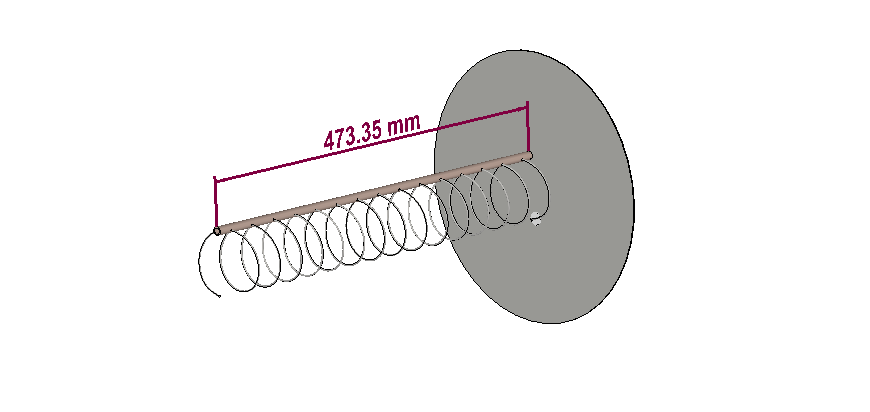

The array has been dimensioned to have a **4x4 element structure**. All of the helical elements are placed in front of a continuous ground plane. While this ground plane has been modeled as a square piece of perfect electric conductor, in the reality, the use of a **metal mesh** is recommended, in order to reduce the wing loading of the structure.

The expert reader may have already noticed one of the problems of this antenna: shuch an array needs a **feeding network**. That's completely true! However, we propose a very simple design that anyone can make with simple coaxial cable. This is posible thanks to the nominal impedance of an helix antenna being 140Ω instead of just 50Ω. More on this at the end of the page.

Finally, from FIDtenas, we thought that some of our readers may have been interested in the design of a **longer single-helix antenna**. Consequently, we designed one! With a length of just over 1m, it offers an incredible gain. You may also try to use it for EME or other DX contacts! Its full specifications are shown in the section below.

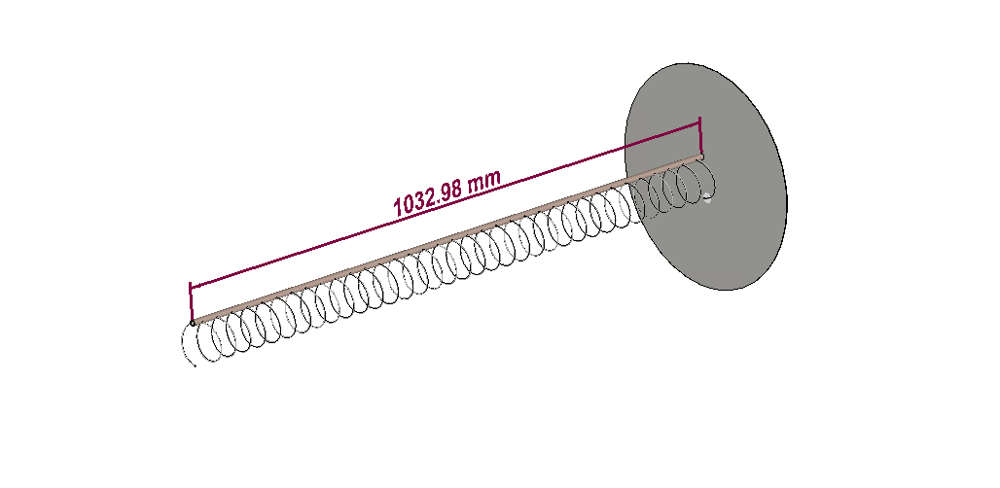

### Main features

The Ollomol antenna highlights some interesting new features:

- **Smallest size:** the global size of the transmitting antenna is only 1.5mx1.5mx0.5m, offering twice the gain of a 6m-long yagi

- **Lowest noise:** the increase in the number of elements of the array brings a huge increase in the Front/Back ratio and a small reduction in the Side Lobes Levels of the radiation pattern due to the inclusion of a bigger ground plane and the cancellation of spurious radiations of each individual element

- **Cheapest build:** all of the materials needed for building this antenna can be bought at any hardware store. Moreover, the use of two different antennae for transmitting and receiving allows the user not to depend on a coaxial relay, connecting the TX side directly to the power amplifier and, the RX side, to an LNA and an SDR

- **Optimised for Amateur Radio:** Ollomol has been design to offer fantastic specifications around the whole 23cm band

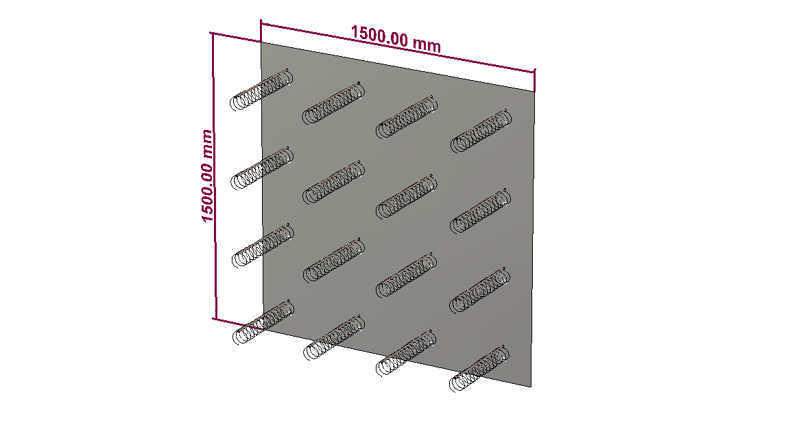

### Antenna Specifications

#### Ollomol 1296MHz / 23cm (Single element) 

|           **Specification**           |  **Value** | **Units** |
|:------------------------:|:------:|:-----:|
|           Gain           |    14.0   |  dBi  |
| 3 dB Beamwidth (E plane) |    34.2    |   º   |
| 3 dB Beamwidth (H plane) |    34.3    |   º   |
|        Efficiency        |    96.0    |   %   |
|         Impedance        |    140-50j      |   Ω   |
|        Lowest SWR        |    1.4     |   -   |
|         Bandwidth        |    308     |  MHz  |
|                          |    23      |   %   |
|       SLL (E plane)      |    -13.8   |   dB  |
|       SLL (H plane)      |    -13.6   |   dB  |
|       Polarization       |  Circular  |   -   |
|            XPD           |    20      |   dB  |
|            F/B           |    24.7    |   dB  |

*Note: bandwidth is measured between points at 1.5 SWR (very conesrvative measure). A matching technique must be used in order to use it with 50Ω transceivers. XPD is referred to broadside direction*

Simulated radiation pattern | Simulated SWR
:-------------------------:|:-------------------------:
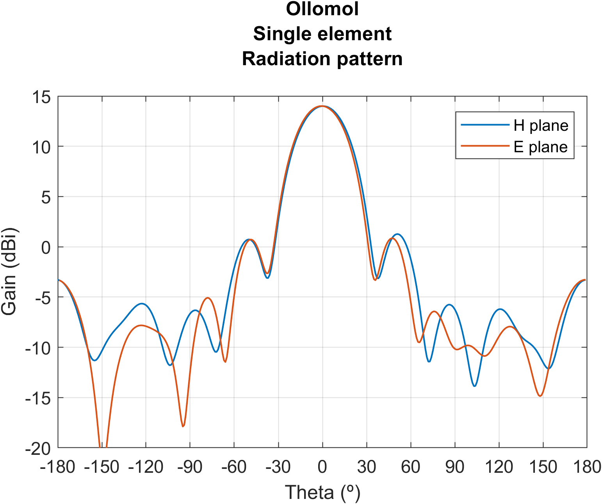  |  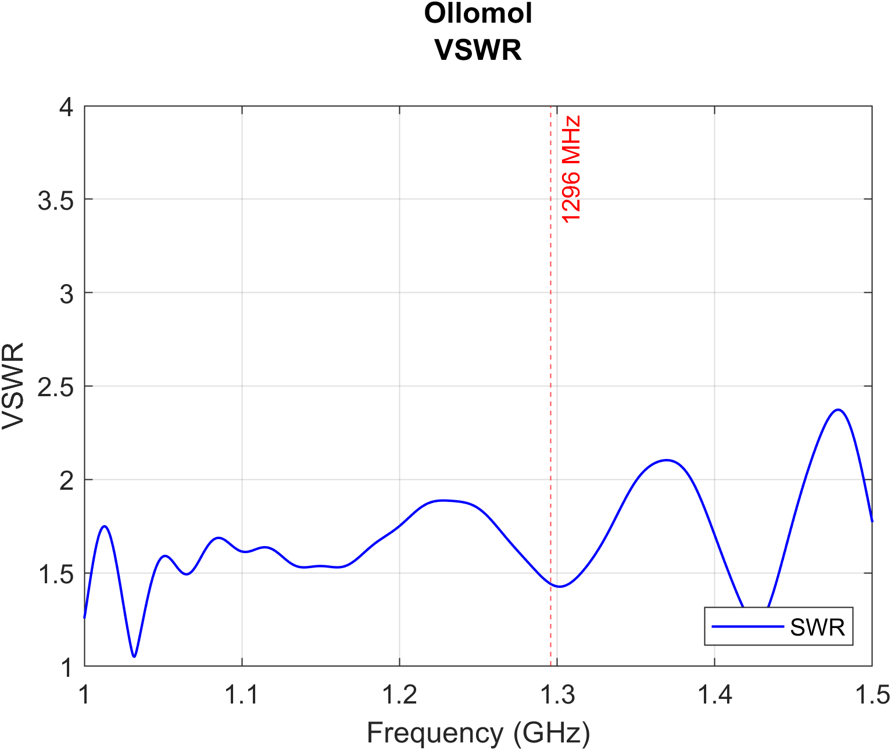

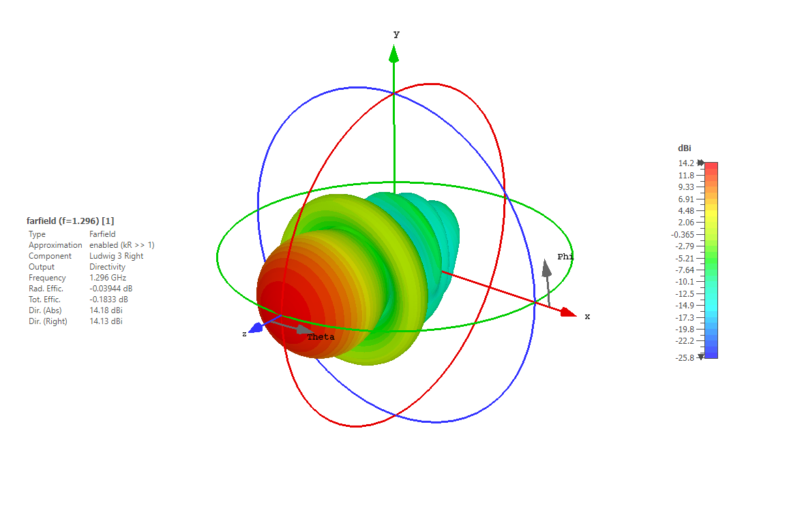

#### Ollomol 1296MHz / 23cm (full array) 

|           **Specification**           |  **Value** | **Units** |
|:------------------------:|:------:|:-----:|
|           Gain           |    26.2    |  dBi  |
| 3 dB Beamwidth (E plane) |    7.3     |   º   |
| 3 dB Beamwidth (H plane) |    7.3     |   º   |
|        Efficiency        |    95.1    |   %   |
|         Impedance       |  50   |   Ω   |
|        Lowest SWR        |    1.4     |   -   |
|         Bandwidth*        |    >20     |   %   |
|       SLL (E plane)      |    -12.5   |   dB  |
|       SLL (H plane)      |    -12.6   |   dB  |
|       Polarization       |  Circular  |   -   |
|            XPD           |    24.9    |   dB  |
|            F/B           |    37.7    |   dB  |

*Note: bandwidth is measured between points at 1.5 SWR, and is referred to the input port of the feeding network. XPD is referred to broadside direction*

Simulated radiation pattern | Simulated SWR
:-------------------------:|:-------------------------:
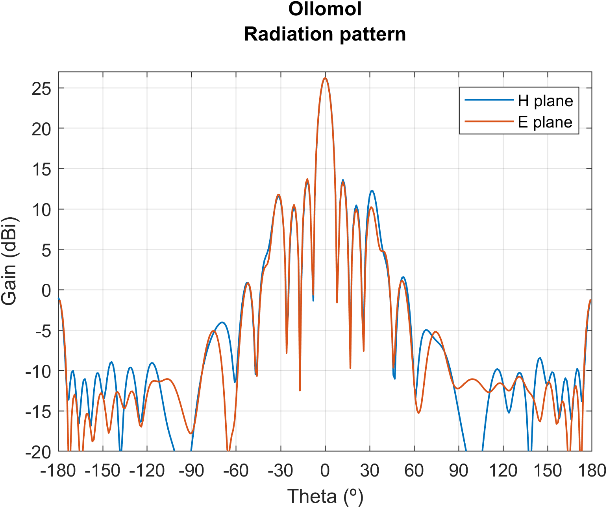  |  

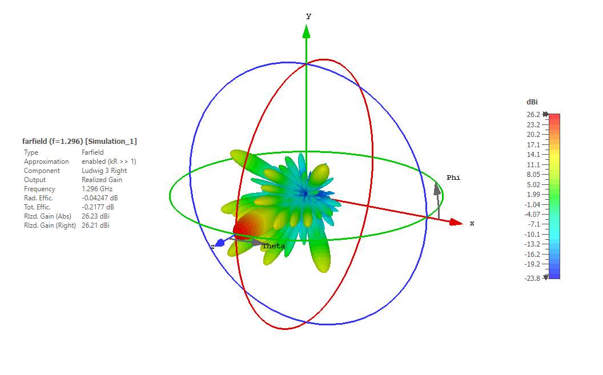

#### Ollomol 1296MHz / 23cm (single-helix version) 

|           **Specification**           |  **Value** | **Units** |
|:------------------------:|:------:|:-----:|
|           Gain           |    21.7    |  dBi  |
| 3 dB Beamwidth (E plane) |    11.8    |   º   |
| 3 dB Beamwidth (H plane) |    11.8    |   º   |
|        Efficiency        |    93.8    |   %   |
|         Impedance*       |  140-50j   |   Ω   |
|        Lowest SWR        |    1.5     |   -   |
|         Bandwidth        |    >20     |   %   |
|       SLL (E plane)      |    -11.0   |   dB  |
|       SLL (H plane)      |    -11.2   |   dB  |
|       Polarization       |  Circular  |   -   |
|            XPD           |    22.4    |   dB  |
|            F/B           |    27.5    |   dB  |

*Note: bandwidth is measured between points at 1.5 SWR. A matching technique must be used in order to use it with 50Ω transceivers. XPD is referred to broadside direction*

Simulated radiation pattern | Simulated SWR
:-------------------------:|:-------------------------:
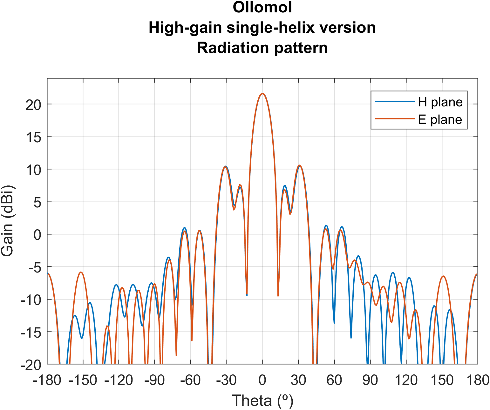  |  

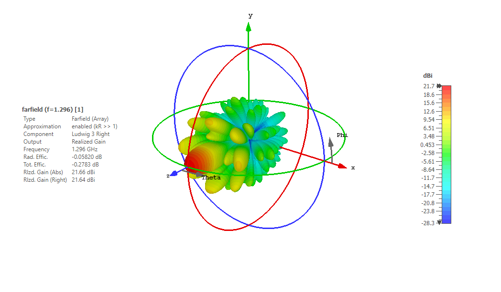

### Feeding network

The feeding network is one of the most important and crucial parts of the antenna: not only will it connect all of the 16 radiating elements to a single port but also match the whole array to an impedance of 50Ω. 

Since we want an array with maximum gain and pointing towards the broadside direction, all the elements will be excited with exactly the same phase: all of the electrical lines from the input port to each of them must have the exact same electrical length. It is very important then to be very precise with the measures when cutting the coaxial lines. 

Without further explaination, the network design can be seen in the following figures. Note that the 37,5Ω lines can be easily obtained by soldering in parallel two 75Ω sections of coaxial and tieing them together. Besides, the length of each section is specified below. Recall that tit is possible to cut the length in the specified base electrical length plus an exact multiple of λ/2. If you go for this, make sure that you maintain the same length on each side of the network, that is, the *k* parameter you choose remains constant for all the elements. 

Finally, remember that the wavelength inside the coax is different that the one in free space. Calculate first the wavelength in your coax (both the 50Ω one and the 75Ω one) before computing the desired length of each of the lines.

**Orange:** line of length 0.47λ + *k* · λ/2            	(for positive integer *k*)

**Blue:** line of length 0.25λ + *k* · λ/2 	           (for positive integer *k*)

**Black:** these **are not** transmission lines and **must not be implemented** with any coax. That are just used as a referenece of the input impedance at that point. Increase the value of *k* in the aforementioned expressions if you need longer lines.

Rows connections | Columns connections
:-------------------------:|:-------------------------:
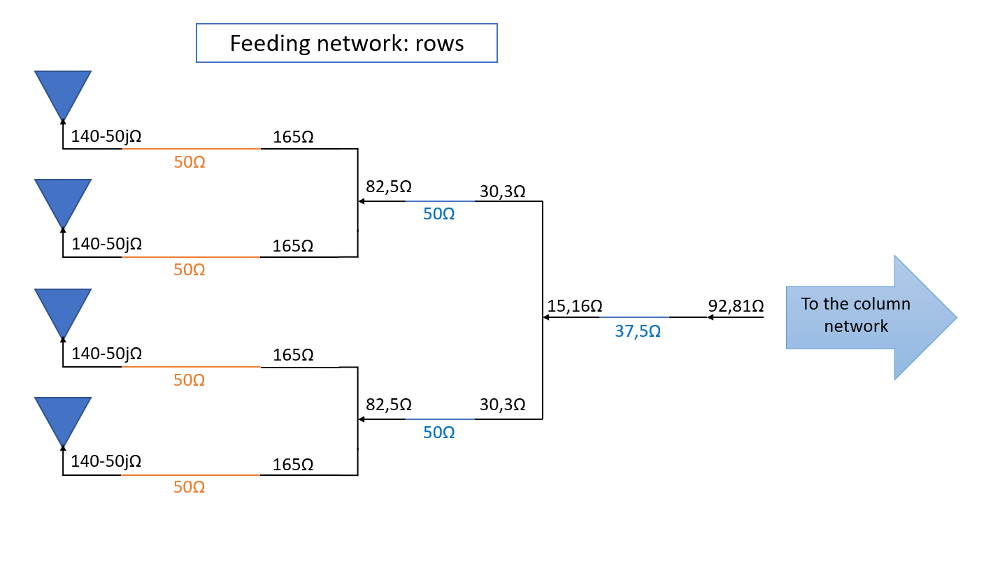  |  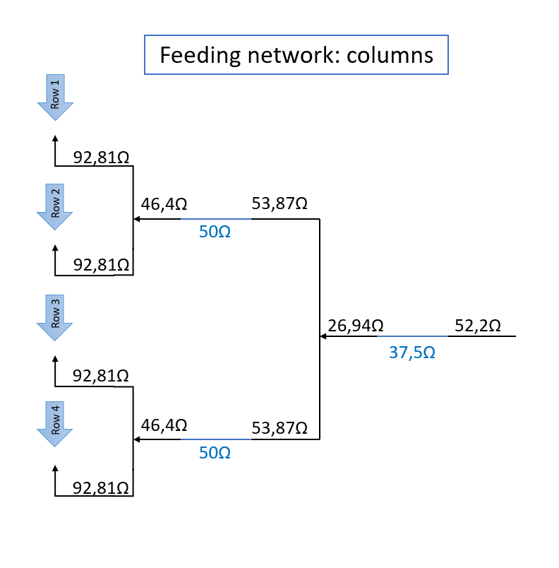

As a basic explaination, an helical antenna has, at its central resonant frequency, an impedance of around 140Ω minus some imaginary part (capacitive loading). Our simulations show that, for values around 1296MHz, this impedance corresponds to 140-50jΩ. Then, the first step of the newtork is using a 0.47λ section to transform it to a real impedance of 165Ω. Afterwards, it is easy to obtain the desired impedances at each step by using classical λ/4 transformers, and obtaining a final impedance of 53,3Ω. Note that this corrresponds to a reflection coefficient of 0,03 or a SWR of just 1,06, with the final loss by impedance missmatch being only 0.004dB!

### Assembly and usage advices

>All of the measurements, plans, .stl files and more can be found in our [GitHub repository](https://github.com/pepassaco/FIDtennas)

For this antenna, we will not provide any specific build instruction. This is because they can vary a lot depending on the materials you decide to use and the specific application you want to use this antenna for. Nevertheless, here are some general guidelines or advices for achiving its full potential:

- **Non-conductive fiberglass** boom is recommended. However, Raposo-2 and Raposo-2 Mini can be build by using a conductive boom separed **at least 5mm** from the antenna elements. You can find several 3D-printable element supports in our repository, and choose the one that fits your needs the best.

- **Use white ABS** with enought infill if you are going to use this antenna for extended periods of time in places with high temperatures.

- Use a **small enought** metal mesh. A metal mesh with big holes will not be seen as a good ground plane at these frequencies. Besides, avoind any wrinkles or knots in the final mount.

- If you are planning to build the long single-helix version, recall that **its input impedance is 150Ω**. You may want to use a copper strip match to lower down this value before transmitting anything.

- It is very important to **follow the described procedure** for assembling the feeding network. Otherwise, you may end up with incredibly high SWR values or degenerated radiation patterns.

We hope to be bringing you some images and results of the final build very soon! Stay tuned!
