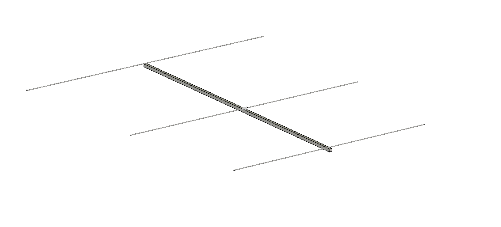
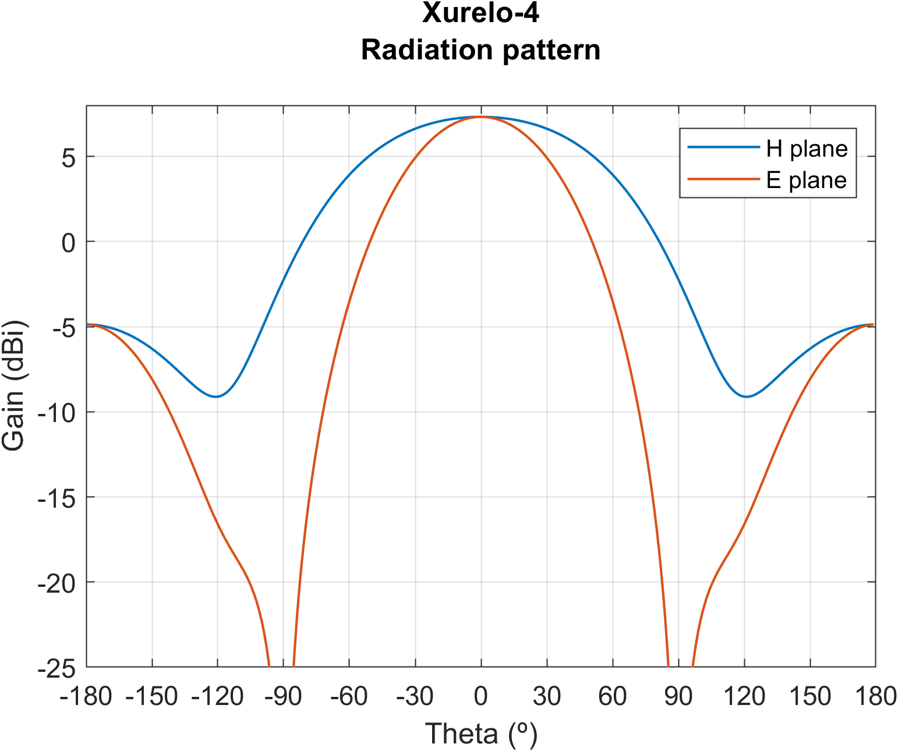
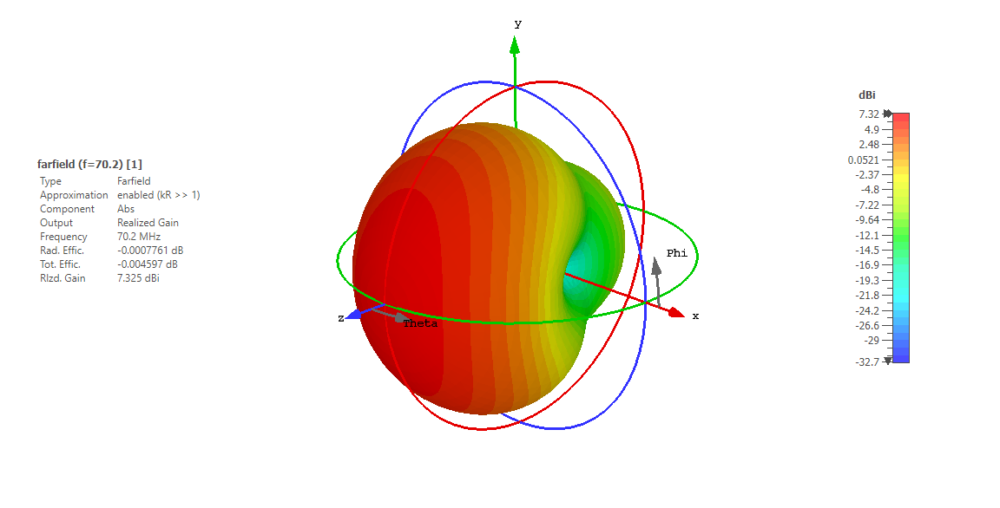

We are presenting our new antenna for the 4m band: Xurelo-4.

The Meteor Scatter season is coming to its peak. While this propagation can be worked on higher frequencies, for the ones with a more modest setup, the 6m band is definitely the way to go. However, most of us cannot afford having a 6m directional antenna up in the ceiling of our houses, either for lack of space or for legal issues. As a solution, from FIDtenas we decided to design a portable 3-element yagi for said band, fast and easy to assemble! 

### Main features

This antenna has been designed with the objective of improving some aspects of other antennas from the market while adding new useful features for the radio operator.

- **Removable elements:** in order to allow its use in portable situations, all of the elements are made out of 1m long threaded rods, so that they can fit inside even the smallest of the cars

- **Adapt it to your needs:** Xurelo-6 can be built by using elements of diameters ranging from M4 to M16 without any significant change in performance: choose the diameter and material (threaded rod, aluminuum, carbon fiber...) to configure the antenna to your needs

- **Cheap and easy to build:** all the materials involved are easy to find in any hardware store. The plans of the 3D printed parts are also public so that anyone can print them at home.

- **Optimal performance:** Xurelo-6 covers the whole 6m band with a SWR lower than 1.5, offering good gain and low SLL across the whole band.

- **Choose any boom:** Xurelo-6 has been design to be assembled with any boom, independently on whether it uses a non-conductive (fiberglass, PVC...) or conductive (aluminum, titanum, carbon fiber...) material.

### Antenna Specifications

#### 50MHz / 6m

|           **Specification**           |  **Value** | **Units** |
|:------------------------:|:------:|:-----:|
|           Gain           |    7.36    |  dBi  |
| 3 dB Beamwidth (E plane) |    66.5    |   º   |
| 3 dB Beamwidth (H plane) |    115.5   |   º   |
|        Efficiency        |    99.7    |   %   |
|         Impedance        |    50      |   Ω   |
|        Lowest SWR        |    1.1     |   -   |
|         Bandwidth        |    2.56    |  MHz  |
|                          |    5.12    |   %   |
|       SLL (E plane)      |    -18.2   |   dB  |
|       SLL (H plane)      |    -18.2   |   dB  |
|       Polarization       |    Linear  |   -   |
|            XPD           |    >70     |   dB  |

*Note: bandwidth is measured between points at 1.5 SWR. XPD is referred to broadside direction*

Simulated radiation pattern | Simulated SWR
:-------------------------:|:-------------------------:
  |  

### Bill of materials

|                 **Material**                  |**Cuantity**|
|:---------------------------------------------:|:--------:|
|            M6* 1000mm threaded rods           |     8    |
|                   M6* nuts                    |    10    |
|            M6* threaded sleeve nuts           |     2    |
|                 M6* washers                   |    10    |
|                   M4 bolts                    |     3    |
|                   M4 wing nuts                |     3    |
|                   M4 washer                   |     3    |
|                  White ABS                    |   ~100g  |
|                2700mm Boom**                  |     1    |
|             50Ohm coaxial cable               |    ~5m   |
|              SMA male connector               |     1    |

\* *This antenna can be build by using elements of diameters ranging from 4mm to 16mm. In order to build the detachable version shwon in this post, M6 or M8 threaded rods are recommended, since they offer a good balance between flex and weight. You can also use full-length aluminuum or carbon fiber tubes if you are looking for a more consistent setup or for a non-portable version.* 

\*\* *Thanks to the 3D printed parts, the elements will be isolated from the boom. Hence, both conductive and non-conductive materials can be used.*

\*\*\* *3D printable parts below are designed for M6 rods and round boom of 16mm of diammeter. They are easily editable for other setups.*

### Assembly instructions

The following points refer to the portable version of the antenna, made out of M6 threaded rods. Recall that the measures of the antenna allows a build of other materials for a non-portable use.

>All of the measurements, plans, .stl files and more can be found in our [GitHub repository](https://github.com/pepassaco/FIDtennas)

1. Print three of the element supports using high enought infill (20% to 30%, depending on the material and weight of the elements). Once printed, fix them to the threaded rodby screwing two M6 nuts and washers, one for each side.

2. Cut the remaining threaded rods in the lengths described at our repository. Assemble the director and reflector by using two threaded sleeve on each, one for each of the sides of the central rod as shown in the following picture:

*Note: if you own a nanoVNA, you may be interested in cutting the dipoles a bit longer so that you can then tune the antenna according to you needs.*

3. Assemble the dipole similarly to the rest of the elements, but introducing the element thought only one of the holes of the support. Use the 1000mm long rod for the inner side of the dipole and connect the remaining threaded rod by using a threaded sleeve.

4. Peel around 3-4cm of coaxial cable wire (inner and outer conductors). Untighten a bit the outer nut of one of the legs of the dipole. Coil the wire around the threaded rod so that it makes a full lap around it. Cut any remaining piece of wire and screw the nut again, the more tight the better. Repeat the process with the other dipole leg. The result should look like the following picture:

**Important:** the coax with a length multiple of the 2m wavenegth must be connected to the 70cm dipole and viceversa. Scroll down to the *Usage* section for a detailed explanaiton about this.

5. Draw some marks on the boom corresponding to the emplacement of the different elements, starting with the last 70cm director at the begining of the mast. Drill M4 holes corresponding to their corerct emplacement across the boom. Assemble the three elements by using the M4 bolts, the washers and the wing nuts.

6. Solder the corresponding SMA connectors.

7. Enjoy!

#### Usage

The portable version of Xurelo-6 (described above) uses M6 or M8 threaded rods for the elements. This can seem to bring a new issue into play: due to their length, they will inevitably bend a bit. However, the antenna has been modeled taking into account this bent and, due to its large curvature radius, it does not affect the performance of the antenna (neither the impedance match nor its gain), so you must not worry about it. 

With respect to its height, it is recommended to place it at least 2,5m above ground in case of working in a location with relatively-high soil conductivity. 

Finally, recall that this antenna was not designed to be used in a fixed emplacement for extended periods of time. If you want to use it for this purpose, the length and spaceing of the different elements can be useful, but you will need to perform some modifications to the structure of the antenna in order to increase its mechanical consistency.

