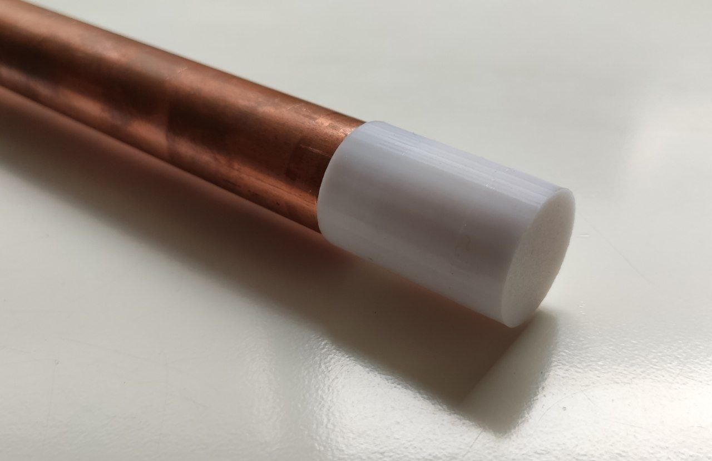

In this post, we would like to share our design of a dielectric lens for the 10,5GHz band. It has been optimised for its use with commercial satellite dishes of f/D of 0,4, achieving optimal efficiency with respect to reflector illumination (-12dB of illumination at its edges). It can be 3D printed in PLA.

### Main features

The main characteristics of our dielectric lens are the following:

- **Cheap and easy to build:** you only need a 3D printer and some PLA to make one!

- **Optimal illumination of the dish:** this lens has been designed to offer around -12dB of illumination at the edges of the reflector, achieving this way an optimal performance

- **Compatible with 22mm waveguide:** designed to be used with widely-availabe 22mm metal tubing, which has become a standard in amateur radio users of the QO-100 satellite

- **Great bandwidth:** this lens includes a matching section to ensure a perfect resonance at 10,489GHz (central frequency of the QO-100 passband) and has wide enought bandwidth as for covering from 10GHz to 11GHz, allowing its use both in the entire 3cm amateur band and as a receiving satellite station for other GEO sats

 

### Antenna Specifications

#### Raposo-2 145MHz / 2m 

|           **Specification**           |  **Value** | **Units** |
|:------------------------:|:------:|:-----:|
|           Gain           |    11.86   |  dBi  |
| 3 dB Beamwidth (E plane) |    42.9    |   º   |
| 3 dB Beamwidth (H plane) |    48.4    |   º   |
|        Efficiency        |    91.0    |   %   |
|        Lowest SWR        |    1.00    |   -   |
|         Bandwidth        |    2.00    |  GHz  |
|                          |    19      |   %   |
|       SLL (E plane)      |    -17.3   |   dB  |
|       SLL (H plane)      |    -16.7   |   dB  |

*Note: bandwidth is measured between points at 1.5 SWR (very conesrvative measure). XPD is referred to broadside direction*

Simulated radiation pattern | Simulated SWR
:-------------------------:|:-------------------------:
  |  

### Build guide

>All of the measurements, plans, .stl files and more can be found in our [GitHub repository](https://github.com/pepassaco/FIDtennas)

This is a very simple to build antenna. In order to make your own, you just have to:

1. Acquire a 22mm metal tube. This will be used as the waveguide connecting the antenna with the LNB. Copper is recommended (you may want to solder a patch antenna for the TX side in the future).

2. Print the dielectric lens. **Important:** use PLA with 100% infill. This ensures a good performance of the dielectric material, matching the simulations.

3. Introduce the waveguide in the dielectric lens to its end. It is as easy as that!

4. Enjoy!

