Today, we are glad to present you a very special antenna: Aiga. 

Aiga is a double band VHF/UHF antenna designed for portable use. In this way, it uses extremely light materials in order to guarantee a confortable use during long satellite passes or SOTA activations. It has been specifically optimised for low elevation satellite passes, achieving good antenna gain while maintaining low side lobes levels for reducing the ammount of noise received.

### Main features

This antenna has been designed with the objective of improving some aspects of other antennas from the market while adding new useful features for the radio operator.

- **Detachable elements:** for improving the overall portability of the antenna, all of the elements (directors, reflectors and dipoles) are completely detachable! They fixing system has been design with the aim of offering an easy and fast solution, so that it is possible to assemble the whole antenna in under a minute.

- **Small size:** the length of the longest element is 1000mm. Moreover, this antenna can be build with a 1000mm boom, so that it is easy to carry with you to wherever you plan to use it.

- **Easy to build:** all the materials involved are easy to find in any hardware store. The plans of the 3D printed parts are also public so that anyone can print them at home.

- **Optimal performance:** Aiga has been designed to offer huge bandwidth for both 2m and 70cm bands and a high gain without compromising the rest of the specifications.

- **VHF, UHF or both:** both the 2m and 70cm parts of the antenna have been design fo offer a 50ohm impedance at tis input, so that you can choose to assemble only one of the bands, assemble each one separately or both in the same boom.

- **No need of a diplexer:** by choosing the adequate length for the transmission lines that start at the dipoles, we offer an innovative design that enables users to have two different connectors (one for each band) or directly connecting both of the outputs to a single connector without affecting the return loss of the antennae (more info below).

- **Choose any boom:** Aiga has been design to be assembled with any boom, independently on whether it uses a non-conductive (fiberglass, PVC...) or conductive (aluminum, titanum, carbon fiber...) material.

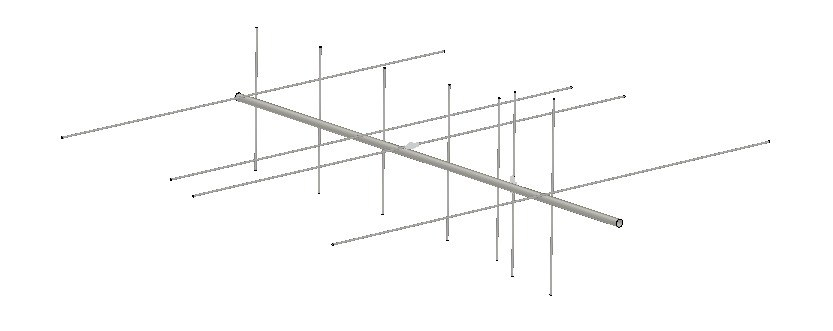

### Antenna Specifications

#### VHF

|           **Specification**           |  **Value** | **Units** |
|:------------------------:|:------:|:-----:|
|           Gain           |    7.91    |  dBi  |
| 3 dB Beamwidth (E plane) |    62.8    |   º   |
| 3 dB Beamwidth (H plane) |    100     |   º   |
|        Efficiency        |    97.2    |   %   |
|         Impedance        |    50      |   Ω   |
|        Lowest SWR        |    1.03    |   -   |
|         Bandwidth        |    12.2    |  MHz  |
|                          |    8.47    |   %   |
|       SLL (E plane)      |    -18.4   |   dB  |
|       SLL (H plane)      |    -18.5   |   dB  |
|       Polarization       |    Linear  |   -   |
|            XPD           |    >60     |   dB  |

*Note: bandwidth is measured between points at 1.5 SWR. XPD is referred to broadside direction*

Simulared adiation pattern | Measured SWR
:-------------------------:|:-------------------------:
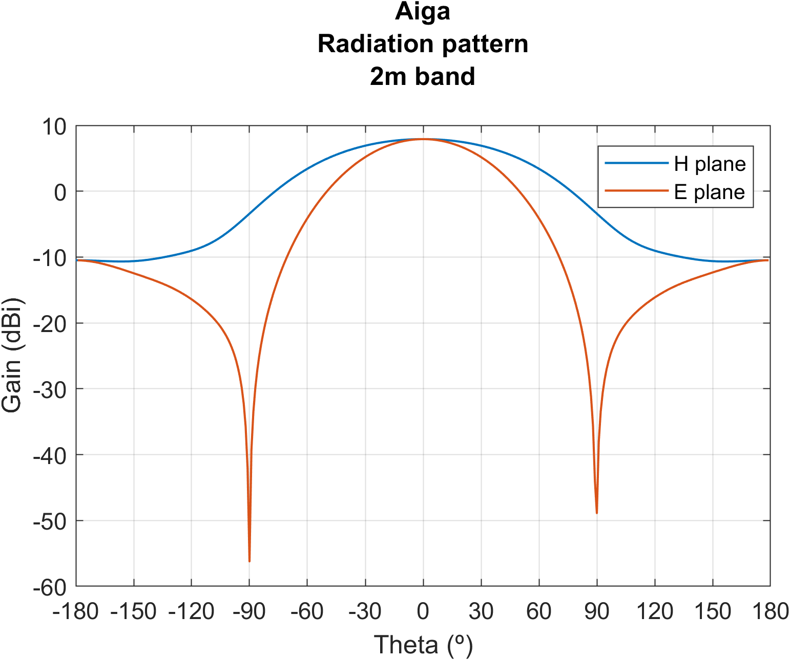  |  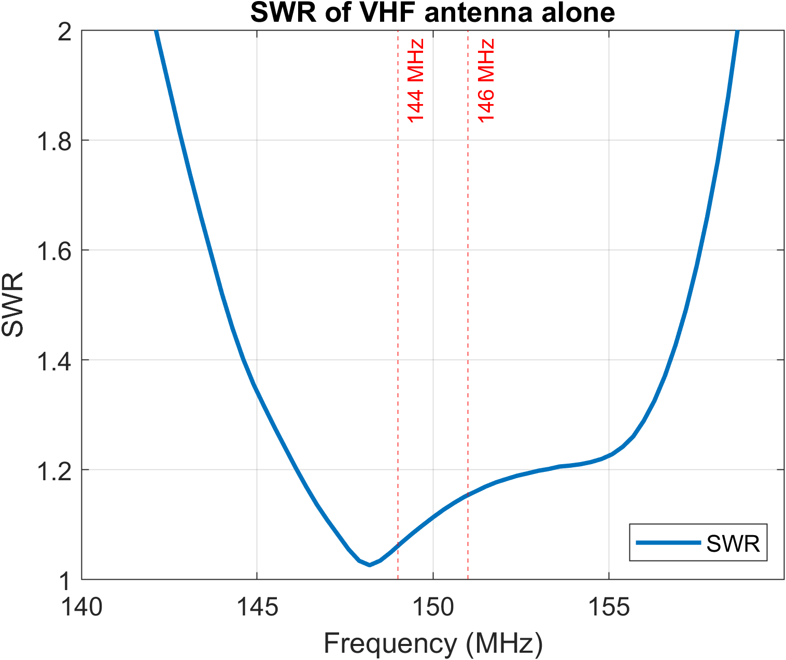

#### UHF

|           **Specification**           |  **Value** | **Units** |
|:------------------------:|:------:|:-----:|
|           Gain           |    10.1    |  dBi  |
| 3 dB Beamwidth (E plane) |    53.2    |   º   |
| 3 dB Beamwidth (H plane) |    68.1    |   º   |
|        Efficiency        |    95.3    |   %   |
|         Impedance        |     50     |   Ω   |
|        Lowest SWR        |    1.04    |   -   |
|         Bandwidth        |    49      |  MHz  |
|                          |    11.2    |   %   |
|       SLL (E plane)      |    -19.5   |   dB  |
|       SLL (H plane)      |    -11.4   |   dB  |
|       Polarization       | Linear |   -   |
|            XPD           |    >60     |   dB  |

*Note: bandwidth is measured between points at 1.5 SWR. XPD is referred to broadside direction*

Simulared adiation pattern | Measured SWR
:-------------------------:|:-------------------------:
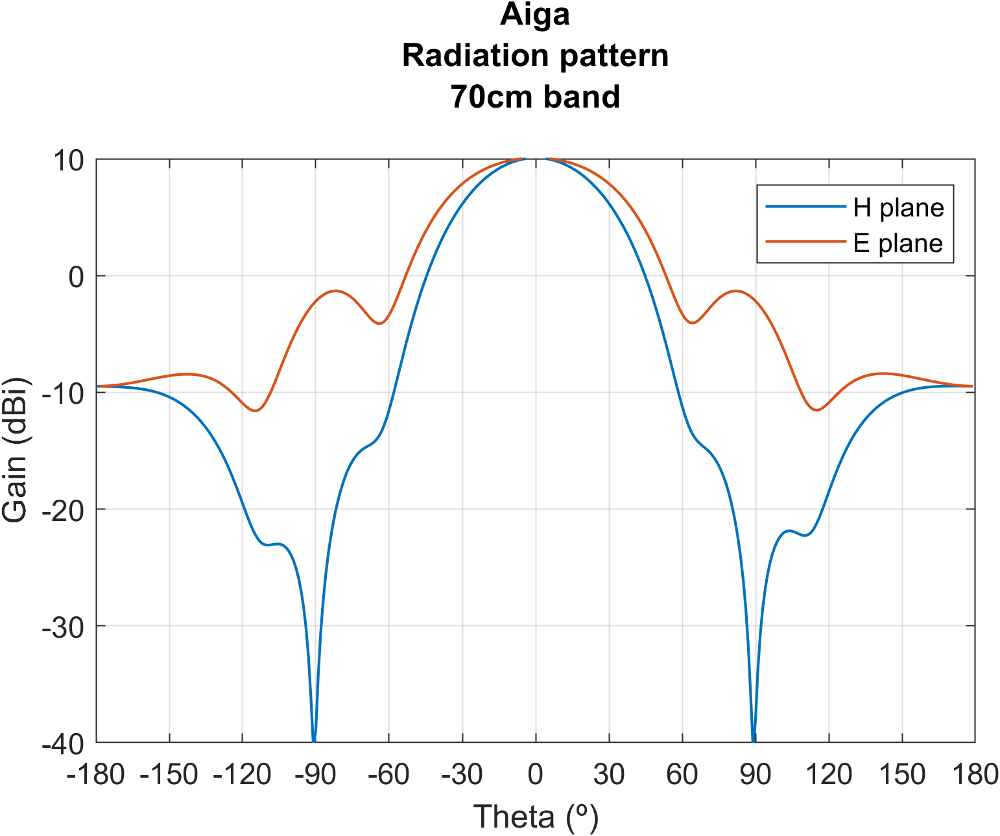  |  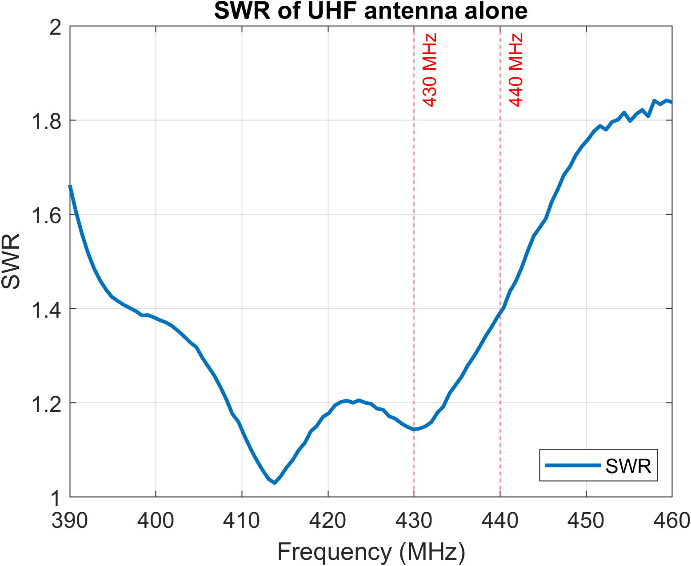

### Bill of materials

|                 **Material**                  |**Cuantity**|
|:---------------------------------------------:|:--------:|
|         M3/M4* 1000mm threaded rods           |     8    |
|                M4 30mm bolts                  |    11    |
|                 M3/M4* nuts                   |    26    |
|                 M4 wing nuts                  |    11    |
|                  White ABS                    |   ~150g  |
|                1000mm Boom**                  |     1    |
|             50Ohm coaxial cable***            |   ~2.5m  |
|             SMA male connectors               |     2    |
| *(Optional)* 2 female to 1 male SMA T adapter |     1    |

\* *This antenna can be build by using either M3 or M4 threaded rods. Note that M4 will offer better consistency at the expense of increased weight.* 

\*\* *1000mm minimum recommended length (adapt to your needs). Can be any conductive or non-conductive tube.*

\*\*\* *In our build, we will use RG-58 cable for convenience. However, if you have some light low-loss cable, there is no problem in using it instead*

\*\*\*\* *3D printable parts below are designed for M3 rods and round boom of 16mm of diammeter. They are easily editable for other setups.*

### Assembly instructions

The following points convey the insstructions to follow in case of assembling the full 2m/70cm bual band antenna. If you only want one of the bands, you must adjust the number of threaded rods, 3D printed parts and more according to your needs.

>All of the measurements, plans, .stl files and more can be found in our [GitHub repository](https://github.com/pepassaco/FIDtennas)

1. This antenna has 11 elements. Hence, you will need to 3D-print 11 of the supports available in our repository. Once they are printed, introduce one of the 30mm bolts through the corresponding hole and fix them with a wing nut without tightening them too much (see picture below). 

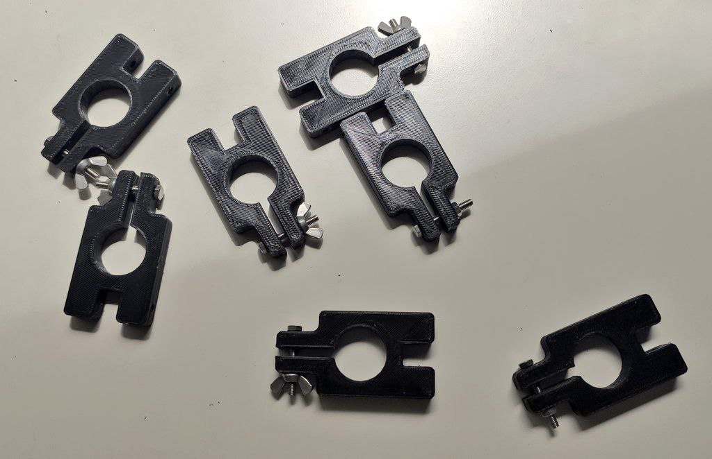

2. Cut the threaded rods in the lengths described at our repository. The more precision you have, the better, specially for the 70cm antenna. Aiga has enought bandwidth in both of the bands as for not needing any tuning if build correctly!

*Note: if you own a nanoVNA, you may be interested in cutting the dipoles a bit longer so that you can then tune the antenna according to you needs.*

3. Assemble the 3D printed supports with the elements.

**Directors and reflector:** introduce the rod through both of the remaining holes of the 3D printed support so that it rests just in the middle of it. Introduce one nut on each side of the threaded rod and tighten them (yes, you will need a bit of patience for the 2m elements).

**Dipole:** the same as with the rest of the elements, but introducing the element thought only one of the holes of the support.

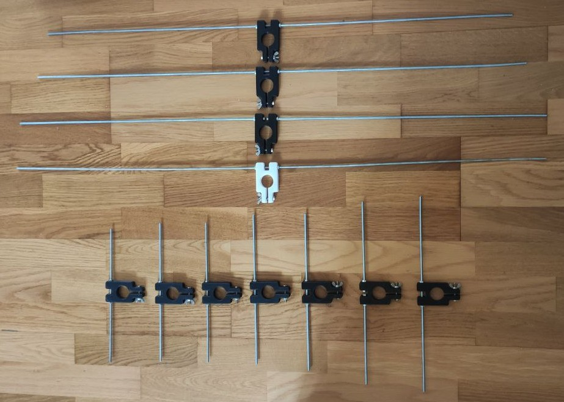

4. Cut exactly a multiple of λ/2 for both the 2m and for the 70cm sections. Note that the wavenlength inside the coax is different from the space free wavelength! For example, in the case of RG-58 coax, whose velocity factor is 0.66, the 2m coax wavelength is 1.375m, and, for the 70cm band, 0.455m. In our case, we decided to cut 1.375m of cable for the 2m band (one wavelength) and 1.365m of cable for the 70cm band (three wavelengths).

5. Peel around 3-4cm of coaxial cable wire (inner and outer conductors). Untighten a bit the outer nut of one of the legs of the dipole. Coil the wire around the threaded rod so that it makes a full lap around it. Cut any remaining piece of wire and screw the nut again, the more tight the better. Repeat the process with the other dipole leg. The result should look like the following picture:

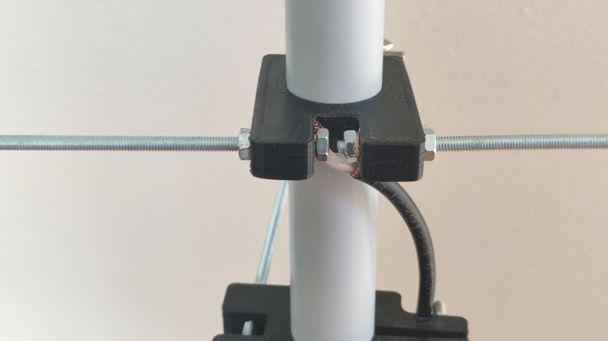

**Important:** the coax with a length multiple of the 2m wavenegth must be connected to the 70cm dipole and viceversa. Scroll down to the *Usage* section for a detailed explanaiton about this.

6. Draw some marks on the boom corresponding to the emplacement of the different elements, starting with the last 70cm director at the begining of the mast. Introduce the 3D printed supports with the elements though the boom to their corresponding location. You can now use the wing nut to tighten them on their corresponding location! After using the antenna, simply untighten the wing nut and take all the elements from the boom to disassemble the antenna.

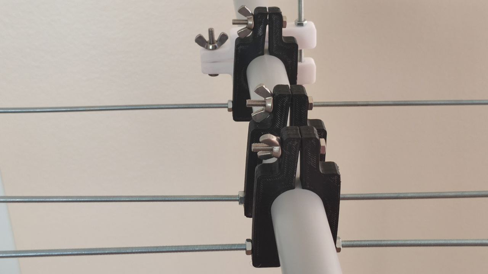

7. Solder the corresponding SMA connectors.

8. Enjoy!

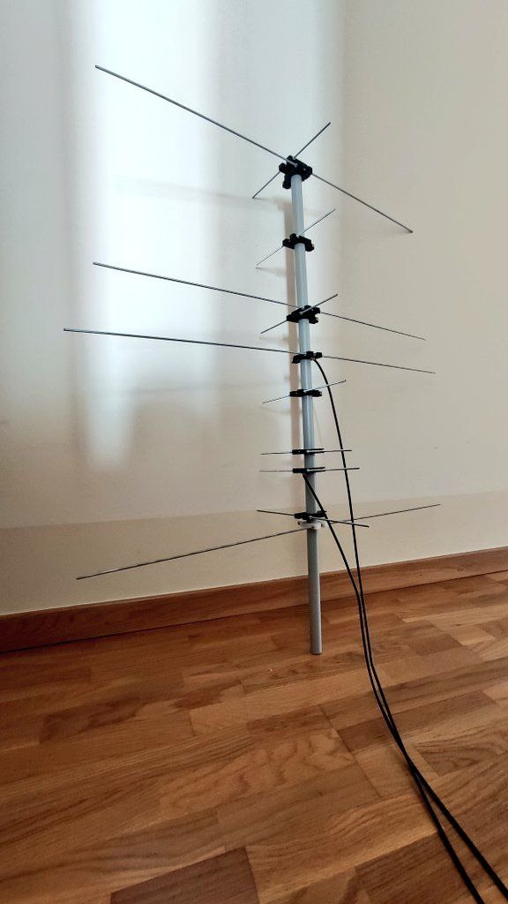

#### Usage

This antenna can be used with two separate connectors, one for each band, and with a single connector as a dual-band antenna. 

For the two connectors configuration, the length of the coax is not important, since both antennae are completely independent and will act as reparate radiant systems. However, for operating Aguia with a single connector, special attention must be paid with respect to the length of the transmission lines. 

One of the main features of this design is that a diplexor is no longer needed for using the antenna with a single port. The way this works is by playing with the lengths of the coaxial lines. 

Assume we are connecting the 2m antenna to a 70cm transceiver. If we used arbitrarily long lines, the impedance of the antenna as seen from the connection port will vary depending on the length of the coax. While the reflection coefficient would be always 1 as seen from its input port, the impedance could be taking any value (even 0 or Infinity). In order to avoid this, we can use a half-wavelength length of coax, which ensures that the output at the output of the antenna will be exactly the same as at the output of the coax. Note, however, that, in this example, we are connecting a 70cm transceiver to the 2m antena. Then, the half-wavelength measure will have to be taken **with respect to the 70cm band**, since this will be the signal that will be traveling across the coax. 

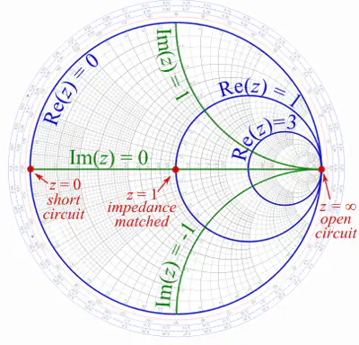

If, instead of connecting a single 2m antenna to a 70cm rig, we connected to the same port both a 70cm antenna and a 2m antenna, the rig would continue seeing an infinite impedance on the 2m branch, while a 50Ohm impedance on the 70cm one. 

Instead of a diplexer, a simple 2-female to 1-male T connector like the one shown in the following picture would suffice: 

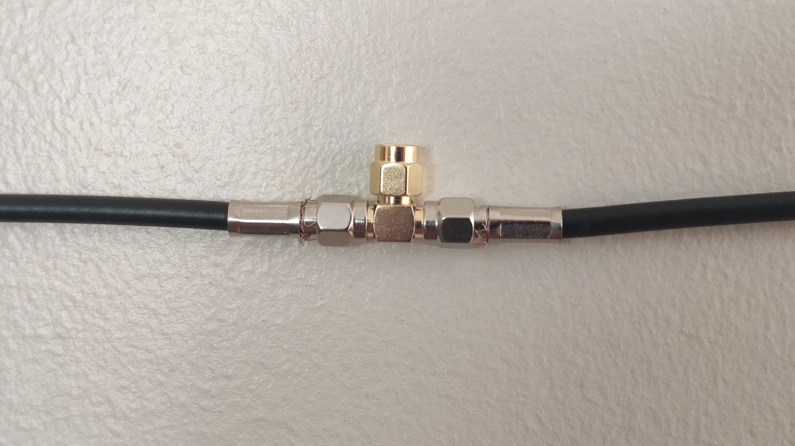
